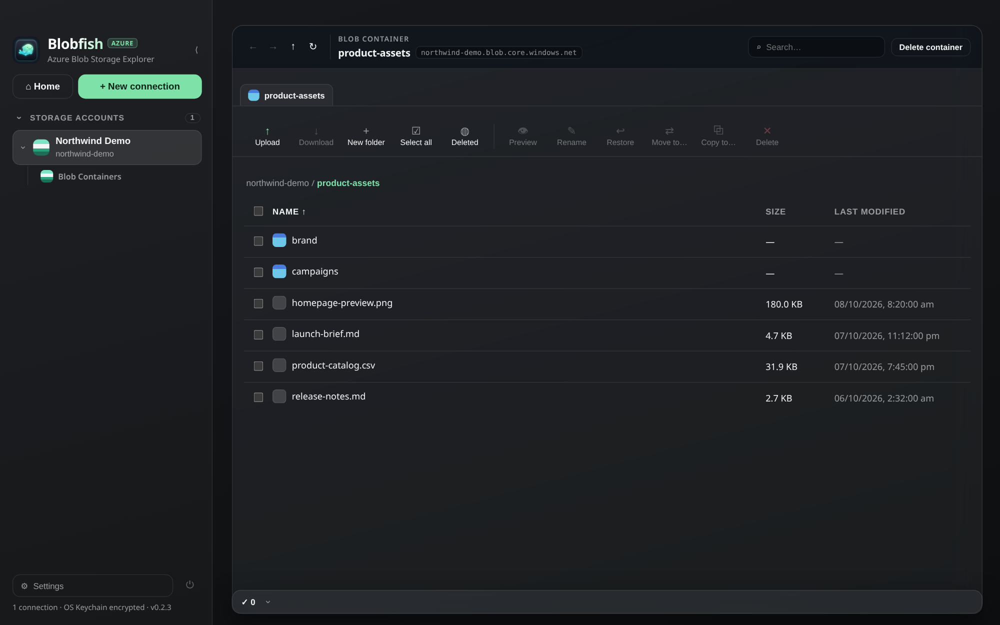

# Blobfish

A fast, native Azure Blob Storage explorer — a lighter replacement for Azure Storage
Explorer. Bun + Electron + React + Vite + TypeScript.

> Status: working explorer (accounts, browse, CRUD, transfers, previews, Azurite).
> See [docs/roadmap.md](docs/roadmap.md) for the full review and what's next.



*Example screenshot using fictional data only; no live Azure account or credentials are used.*

## Why

Azure Storage Explorer is itself Electron-based but heavy and sluggish for large
containers. Blobfish aims for: instant startup, predictable blob lists, background
transfers that live in the tray, and first-class support for
local Azurite development.

## Install

**Homebrew (macOS):**

```bash
brew tap pylotlight/blobfish https://github.com/PylotLight/Blobfish.git
brew install --cask blobfish
```

Or download binaries (macOS dmg/zip, Apple Silicon + Intel) from
[Releases](https://github.com/PylotLight/Blobfish/releases). Builds are unsigned
for now — macOS Gatekeeper (stricter on macOS 26/Tahoe) may report
““Blobfish” is damaged and can’t be opened”. That means unsigned + quarantined,
not a bad build. Click Cancel (don't trash it), then clear the quarantine flag:

```bash
xattr -cr /Applications/Blobfish.app
```

and open again (right-click → Open on first launch). If Gatekeeper still blocks
it, install normally then clear the flag yourself (Homebrew removed its
`--no-quarantine` option in v6, so this is now the only path):

```bash
brew install --cask blobfish
xattr -cr /Applications/Blobfish.app
```
Linux isn't packaged in releases yet; run from source below.

**npm / Bun (convenience):**

```bash
bunx blobfish
```

This downloads the npm package and launches the built app. On first run the
launcher fetches a pinned Electron via your own runner (`bunx`/`npx`, ~100 MB,
cached afterwards) — no separate install step. It requires a published `out/`
build in the package; for the signed install prefer Homebrew or a GitHub
release asset above.

## Quickstart

```bash
bun install
bun run dev
bun run build && bun run start
```

Shortcuts: `⌘F` / `Ctrl+F` focuses search, `⌘B` / `Ctrl+B` collapses or expands
the sidebar. Repeated auth failures (e.g. selecting a container while off VPN)
collapse into a single "Access denied (403)" banner and one activity entry.

Template docs (architecture, bridge rules, vibrancy, troubleshooting) live in `docs/`
and apply as-is. Cutting a release: `bun run release` — see
[docs/releasing.md](docs/releasing.md).

## Roadmap

- [x] **Accounts** — connection strings, SAS URLs, account key + custom endpoint;
  secrets in the OS keychain via `safeStorage`, never on disk in plaintext
- [x] **Browse** — containers → blob hierarchy, prefix navigation, search,
  sorting, breadcrumb + back/forward, Quick Access pins, collapsible sidebar
- [x] **Transfer** — parallel block-blob upload/download with progress dock,
  cancel/retry, background completion in the tray
- [x] **Preview** — range-based text/CSV preview tabs in-app
- [x] **Azurite** — one-click local emulator profile for development
- [x] **Polish** — themes/accents/density/motion settings, tray icons,
  expiry-aware SAS warnings, transfer + activity history
- [ ] **Scale** — virtualized lists, server-side paging indicators, short-TTL
  blob-list cache (see [docs/roadmap.md](docs/roadmap.md) §1.2/§3)

All UI goes through the typed `window.api` bridge; Azure SDK calls stay in
`src/main`.
